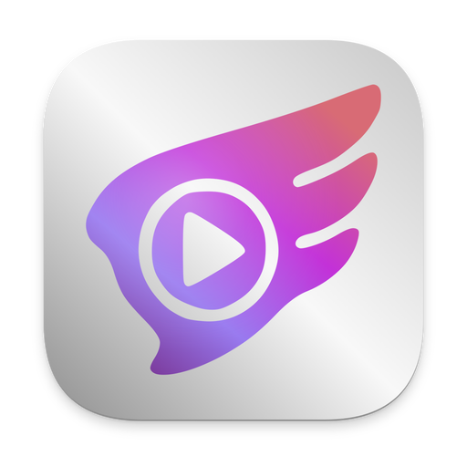
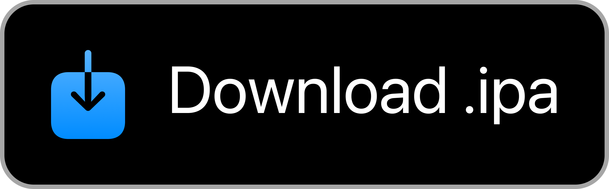
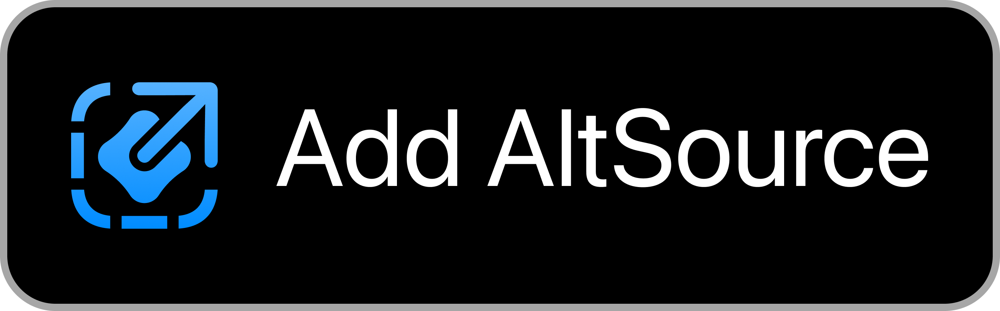

  

  

  <b>Android · iOS · Web</b>

  <a href="#download">Download</a> &nbsp;·&nbsp;
  <a href="#start-a-room">Start a room</a> &nbsp;·&nbsp;
  <a href="#screenshots">Screenshots</a> &nbsp;·&nbsp;
  <a href="#help">Help</a> &nbsp;·&nbsp;
  <a href="docs/DEVELOPING.md">Build</a>

Synkplay is an independent [Syncplay](https://syncplay.pl/) client for phones, tablets and Android TV, with a browser version on the way.
When one person in the room pauses, plays or skips, the same thing happens for everyone else.
It speaks the same protocol as the original Syncplay, so friends on a computer can join the same room.

> [!NOTE]
> Each person opens the same video from their own file or link. Synkplay only keeps playback in step. Nothing from your video or screen is sent to anyone.

## Download

<!-- Rows have the same purpose on both platforms: store, direct file, other source. -->
<table align="center">
  <tr>
    <th align="center">Android</th>
    <th align="center">iPhone &amp; iPad</th>
  </tr>
  <tr>
    <td align="center">
       Store install
    </td>
    <td align="center">
       Store install
    </td>
  </tr>
  <tr>
    <td align="center">
       Full Android APK
    </td>
    <td align="center">
       IPA for sideloading
    </td>
  </tr>
  <tr>
    <td align="center">
       ExoPlayer only
    </td>
    <td align="center">
       Add to AltStore
    </td>
  </tr>
</table>

Android 8.0 or newer. The IPA needs iOS 14.1 or newer. Store builds usually land a few days after the GitHub release.

The browser version is not ready yet. On a computer, install the [official Syncplay client](https://syncplay.pl/download/) and join the same room.

<b>Which download should I choose?</b>

- **Android:** Google Play is the easy route. The full APK on GitHub is the same app, with mpv, ExoPlayer and KitePlayer, and it runs on every supported CPU.
- **IzzyOnDroid:** a smaller build with ExoPlayer only. It installs next to the full app as a separate app, with its own settings.
- **iPhone and iPad:** the App Store. If you would rather sideload, [set up AltStore Classic](https://faq.altstore.io/), then use **Add to AltStore** above.

## Start a room

1. Everyone joins the same room: same server, same port, same room name. The default public server works fine.
2. Everyone opens the same video, from a file on their device or from a link.
3. Tap **Ready**. When everyone is ready, press play.

You can share an invite link from inside the room. The link only opens on a device that has Synkplay installed.

To watch by yourself, tap the logo on Home and pick **Watch alone**. It needs no server, and it remembers where you stopped.

## What you can do

- Play, pause and seek together.
- Chat with text, emoji and GIFs while you watch.
- Share a playlist that moves on to the next file by itself.
- Set your own time offset when your copy has a longer intro.
- Load your own subtitle files, on players that support them.
- Host a room on your own device with **Host mine** on Home.
- Work the whole app with a remote on Android TV.

<b>Also in there</b>

- Themes, gesture controls and a reduced-motion option.
- Undo for the shared playlist.
- Preferred audio and subtitle languages.
- Picture-in-Picture on Android, and on iOS with AVPlayer or VLCKit.
- Managed rooms, where one controller decides playback.
- Hidden or hashed filenames and file sizes.
- Encrypted connections, when the server supports them.

## Screenshots

  
  &nbsp;&nbsp;
  

Android home (portrait) · Android room (landscape) · Click a screenshot to open it full size.

## Help

<b>Can my friends use Syncplay on PC?</b>

Yes. They join the same server, port and room, and open the same video. Synkplay and the official Syncplay client mix fine in one room.

<b>A video or subtitle does not play right.</b>

Leave the room, pick a different player on Home, and join again.
The defaults are **mpv** on the full Android build and **VLCKit** on iOS.
KitePlayer is still experimental on phones. AVPlayer cannot load subtitle files.
[Compare the players](docs/DEVELOPING.md#player-capabilities).

<b>Why do I have two Android apps?</b>

The IzzyOnDroid app and the full app (GitHub or Google Play) use different app IDs, so Android treats them as two apps.
One does not update the other, and each keeps its own settings.

For anything else: [Report a bug](https://github.com/yuroyami/syncplay-mobile/issues/new?template=bug_report.yml) · [Ask a question](https://github.com/yuroyami/syncplay-mobile/discussions) · [Request a feature](https://github.com/yuroyami/syncplay-mobile/issues/new?template=feature_request.yml)

## Contributing

Translations are the easiest way to help. Bug reports with steps to reproduce, and tested patches, are welcome too.

**[Translate on Weblate](https://hosted.weblate.org/engage/syncplay-mobile/)** &nbsp;·&nbsp;
**[Build & test](docs/DEVELOPING.md)** &nbsp;·&nbsp;
**[Support development](https://ko-fi.com/sidenaakram)**

<b>Credits</b>

- [Syncplay](https://syncplay.pl/) and [Et0h](https://github.com/Et0h), for the original project and their help.
- [soredake](https://github.com/soredake), for testing.
- [Osanosa](https://github.com/Osanosa), for contributions.
- [Zhaodaidai](https://github.com/Zhaodaidai), [DoncanC](https://github.com/DoncanC), [ivy-reps](https://github.com/ivy-reps) and everyone translating on Weblate.

---

  Built by <a href="https://github.com/yuroyami">yuroyami</a> with Kotlin &amp; Compose Multiplatform. 
  <a href="CHANGELOG.md">Release notes</a> &nbsp;·&nbsp;
  <a href="PRIVACY_POLICY.md">Privacy</a> &nbsp;·&nbsp;
  <a href="LICENSE">AGPL-3.0 license</a>

